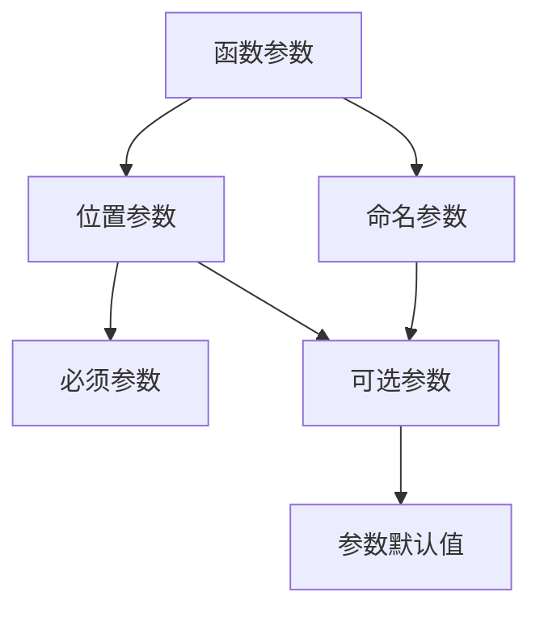

## 背景

`Dart`是由谷歌开发的计算机编程语言，它可以被用于`Web`、服务器、移动应用和物联网等领域开发。

`Dart`诞生于`2011`年，号称要取代`JavaScript`。但是一直不温不火，直到`Flutter`的出现才被重视起来，`Flutter`想学习的话就必须会`Dart`

[官方网站](https://dart.dev/)

<!-- more -->

<InArticleAdsense
    data-ad-client="ca-pub-1725717718088510"
    data-ad-slot="7426219401">
</InArticleAdsense>

## 变量、常量、命名规则

### 变量

`Dart`是一个强大的脚本类语言，可以不预先定义变量类型，自动会类型推倒，`Dart`中定义变量可以通过`var`关键字也可以通过具体的类型来进行声明

``` dart
var str_var = "1111";
String str_str = "1111";
```

> 定义私有方法就是在方法前面加 `_`

``` dart
initListData()

_initListData()
```

### 命名规则

1. 变量名称必须由数字、字母、下划线和美元符(`$`)组成
2. 注意：标识符不能是数字开头
3. 标识符不能是保留字和关键字
4. 变量名字是区分大小写的；如`age`和`Age`是不同的变量。
5. 标识符(变量名称)一定要见名思意：变量名称建议用名词，方法名称建议用动词

### 常量

在`Dart`中常量的修饰符有两种：`final`和`const`

`const`:从声明那一刻就需要进行赋值，后续无法通过逻辑对其值进行改变

`final`:声明时可以不用赋值，但是一旦赋值后就不可改；`final`是惰性初始化

### 字符串类型

#### 定义字符串的几种方式

1. 使用`var`定义

``` dart
var str1 = "xingcxb.com"
```

2. 使用指定类型变量来定义

``` dart
String str1 = "xingcxb.com"
```

> 对于声明的字符串类型的数据，使用单个双引号/单引号可以、使用三个双引号/单引号也可以，数据包裹在三个单引号/双引号中的时候，打印的排版等于定义时候的排版

#### 字符串的拼接

1. 使用`$`

``` dart
var str1 = "xingcxb"
var str2 = ".com"
print("$str1 $str2")
```

2. 使用`+`

``` dart
var str1 = "xingcxb"
var str2 = ".com"
print(str1 + str2)
```

### 数值类型

#### `int`

> 整数类型，只能存放整数数据

#### `double`

> 小数类型，可以存放整型数据和小数数据；整型放入的时候会自动增加一个小数位，实际存储的还是`double`类型

#### 运算符

没啥好说的，基础的`+`、`-`、`*`、`/`、`%`

### `bool`

没啥好了解的，值只能是`true`、`false`

### `List`（数组/集合）

> 在`Dart`中如果使用`var`声明的集合，集合内的元素可以是不同类型的

#### 定义`List`的几种方式

1. 定义多数据类型的集合

``` dart
var value = ["不器小窝",366,true];
```

2. 定义指定数据类型的集合

``` dart
var value = <String>["张三","李四"];
```

3. 定义一个空集合

``` dart
var value=[];
```

> 数组中的容量都是可变的

4. ~~使用`new`来进行创建集合~~

> 新版中的`dart`中这个方案已经被废弃

``` dart
var value = new List();
```

5. 创建固定长度的集合

``` dart
// length为长度
// fill为元素

// 创建一个任意类型的固定长度集合
var value = List.filled(length,fill)

// 创建一个指定类型的固定长度集合
var value = List.
```

#### 改变集合的方法

使用下标进行修改集合中的元素

``` dart
var value = [];
value[0] = 1;
```

> 集合的长度是无法通过`length`直接进行修改的，只能通过**添加/删除**集合中的元素或者使用**filled**方法来改变集合的长度

### `Maps`

#### 定义`Maps`

1. 声明赋值

``` dart
var site={
  "name":"不器小窝",
  "domain":"https://xingcxb.com"
};
```

2. 使用`new`创建

``` dart
var site = new Map();
p["name"] = "不器小窝";
p["domain"] = "https://xingcxb.com";
```

### 运算符

#### 算数运算符

| 运算符 | 符号 |     说明     |
| :----: | :--: | :----------: |
|   加   | `+`  | 用于数据相加 |
|   减   | `-`  | 用于数据相减 |
|   乘   | `*`  | 用于数据相乘 |
|   除   | `/`  | 用于数据相除 |
|  取整  | `~/` | 用于数据取整 |
|  取余  | `%`  | 用于数据取余 |

#### 关系运算符

|  运算符  | 符号 |                 说明                 |
| :------: | :--: | :----------------------------------: |
|   等于   | `==` |       判断两个变量的值是否相同       |
|  不等于  | `!=` |      判断两个变量的值是否不相同      |
|   大于   | `>`  |   判断左侧的变量是否大于右侧的变量   |
|   小于   | `<`  |   判断左侧的变量是否小于右侧的变量   |
| 大于等于 | `>=` | 判断左侧的变量是否大于等于右侧的变量 |
| 小于等于 | `<=` | 判断左侧的变量是否小于等于右侧的变量 |

#### 逻辑运算符

| 运算符 |  符号  |                                               说明                                               |
| :----: | :----: | :----------------------------------------------------------------------------------------------: |
|  取反  |  `!`   |                               用于将结果为`bool`类型的数据反向提取                               |
|  并且  |  `&&`  | 用于将两个`bool`类型的值进行并行获取结果，两个变量都为`true`时这个整体为`true`；否则值为`false`  |
|  或者  | `||` | 用于将两个`bool`类型的值进行并行获取结果，两个变量都为`false`时这个整体为`false`；否则值为`true` |

#### 赋值运算符

|  运算符  | 符号 |                 说明                 |
| :------: | :--: | :----------------------------------: |
|   赋值   | `=` |       将右边的值赋予左边的变量       |
|   空感知赋值   | `??=` |       运算符将值分配给其左侧的变量，仅当该变量当前为 null 时       |
|   赋值   | `??=` |       原来的变量有值时候,那么??=不执行；原来的变量为null,则赋值给这个变量       |

#### 复合赋值运算符

|  运算符  | 符号 |                 说明                 |
| :------: | :--: | :----------------------------------: |
|   加等于   | `+=` |       将左边的变量与右边的值进行加并赋值给左边的变量       |
|   减等于   | `-=` |       将左边的变量与右边的值进行减并赋值给左边的变量       |
|   乘等于   | `*=` |       将左边的变量与右边的值进行乘并赋值给左边的变量       |
|   除等于   | `/=` |       将左边的变量与右边的值进行除并赋值给左边的变量       |
|   取余等于   | `%=` |       将左边的变量与右边的值进行取余并赋值给左边的变量       |
|   取整等于   | `~/=` |       将左边的变量与右边的值进行取整并赋值给左边的变量       |


#### 三目运算符

> 条件运算符的符号表示为`?:`，使用该运算符时需要有三个操作数，因此称其为三目运算符

``` dart
// 基础语法
bool flag = true;
String = flag ? "true" : "false"
```

#### `??`运算符

等同于空感知赋值

#### 自增运算符

在赋值运算里面，如果`++`、`--`写在前面，这时候是先运算，后赋值
在赋值运算里面，如果`++`、`--`写在后面，这时候是先赋值，后运算


## 类型转换

### `Number`与`String`类型之间的转换

#### `Number`转`String`

使用`toString()`

``` dart
int str = 123;

String nstr = str.toString();
```

#### `String`转`Number`

使用`int.parse()`

``` dart
String str = '123';

int nStr = int.parse(str);
```

#### `String`转`double`

同[`String`转`Number`](#string转number)，将`int`变更为`double`即可


## `try...catch`

### 语法

  ``` dart
  try{
    ...
  }catch(err){
    ...
  }
  ```

## 循环
### `for`

#### 基本语法

``` dart
for (int i = 1; i <= 100; i++){
  print(i);
}
```

### `for in`

#### 基本语法

``` dart
for (var item in myList){
  print(item);
}
```

### 集合本身的`forEach`携带的方法

#### 基本语法

``` dart
List myList = ["香蕉","苹果","西瓜"];
myList.forEach((value){
  print("$value")
});
```

## `List`

> 个人理解：在`Dart`中的`List`类型类似于`Java`中的数组
### 常用属性

- `length`：长度
- `reversed`：翻转
- `isEmpty`：是否为空
- `isNotEmpty`：是否不为空

### 常用方法

- `add`：增加
- `addAll`：拼接数组
- `indexOf`：查找 传入具体值
- `remove`：删除 传入具体值
- `removeAt`：删除 传入索引值
- `fillRange`：修改
- `insert(index,value);`：制定位置插入
- `insertAll(index,list);`：制定位置插入`List`
- `toList()`：其它类型转换成`List`
- `join()`：`List`转换成字符串
- `split()`：字符串转换成`List`
- `forEach`：迭代整个集合
- `map`：主要用于修改集合中的数据
- `where`：主要用于筛选集合中在条件内的数据
- `any`：用于判断集合中是否存在条件内的数据，返回`bool`值，集合中只需要一个值符合条件的就为`true`
- `every`：用于判断集合中是否存在条件内的数据，返回`bool`值，集合中全部的值都是符合条件的才为`true`

#### `map`方法的使用

``` dart
List myList = [1,2,3];
var newList = myList.map((value){
  // 修改myList中的值，将值赋值到新的变量中
  return value*2
});
```

#### `where`方法的使用

``` dart
List myList = [1,2,3,4,5,6,7,8,9];
var newList = myList.where((value){
  // 将myList中数据大于5的数字赋值到newList中
  return value>5;
});
```

#### `any`方法的使用

``` dart
List myList = [1,2,3,4,5,6,7,8,9];
var f = myList.any((value){
  // 如果myList中存在大于5的数据，那么f的值为true
  // **只要集合中有一个满足条件的f即为true**
  return value>5;
});
```

#### `every`方法的使用

等同于[any方法的使用](#any方法的使用)

#### 小技巧

1. 在使用`(value){...}`进行迭代时，如果只有一行代码时可以使用`(value)=>(...)`

## `Set`

1. 主要作用就是去除数组中重复的数据
2. 没有顺序且不能重复，所以不能通过索引去获取值

## 自定义方法

### 语法

返回类型 方法名称(参数...){
  方法体
  reutrn 返回值;
}

``` dart
void test(){
  print("123");
}
```

## 函数初解

### 函数参数

::: center

:::

### 闭包

闭包的作用，函数嵌套函数，内部函数会调用外部函数的变量或参数

闭包的写法：函数中嵌套函数，并`return`里面的函数，这样就形成了闭包

1. 全局变量特点：全局变量常驻内存、全局变量污染全局
2. 局部变量的特点：不常驻内存会被垃圾机制回收、不会污染全局

### 类中静态成员

1. 使用`static`关键字来实现类级别的变量和函数
2. 静态方法不能访问非晶态成员，非静态方法可以访问静态成员

### `Dart`中的对象操作符

- `?`     条件运算符
- `as`    类型转换
- `is`    类型判断
- `..`    级联操作


### 继承

1. 子类使用`extends`关键词来继承父类
2. 子类会继承父类利民可见的属性和方法，但是不会继承构造函数
3. 子类能复写父类的方法`getter`和`setter`

## 小技巧

1. 可以通过`is`来判断变量类型

  ``` dart
  var str = '123';

  if(str is String){
    print('是String类型');
  }else if(str is int){
    print('是int类型');
  }else{
    print('其它类型');
  }
  ```

2. 可以通过`isEmpty`来判断字符串是否为空

  ``` dart
  var str = '';

  if(str.isEmpty){
    print("str空");
  }else{
    print("str不为空");
  }
  ```

## 实战经验

### 在 `macOS` 上如何模拟双指操作

鼠标在模拟器界面上按住 `option` 按钮即可

### `Uri`数据构建

1. 使用 `http` 或 `https` 方式

    ``` dart
    var url = Uri.https('xingcxb.com');
    ```

2. 使用 `parse` 方式

    ``` dart
    var url = Uri.parse('https://xingcxb.com')
    ```

就我个人而言我更喜欢第二种，毕竟不用看参数需要传递哪些

### `http` 请求异步处理方案

``` dart
  void httpGet() async {
    var value = await http.get(Uri.parse("https://xingcxb.com"));
    if (value.statusCode == 200) {
      print('数据为：${value.body}');
    } else {
      print('请求失败');
    }
  }
```

### `flutter` 如何加载本地图片

1. 在 `pubspec.yaml` 下找到 `flutter` 根节点，将文件路径添加进去即可；此处讲解以图片文件存放在项目的根目录下的 `assets/images` 中

  ``` yaml
  ...
  flutter:

    # The following line ensures that the Material Icons font is
    # included with your application, so that you can use the icons in
    # the material Icons class.
    uses-material-design: true

    assets:
      - assets/images/2.jpeg
  ...
  ```

2. 在绘制界面的代码模块中使用下列代码来进行加载

  ``` dart
    ...
    // 加载本地图片
    Image.asset(
      "assets/images/2.jpeg",
      width: 110,
      height: 220,
    ),
    // 加载网络图片
    Image.network(
      'https://pic.netbian.com/uploads/allimg/230224/131035-16772154352d36.jpg',
      width: 110,
      height: 220,
    ),
    // 加载网络图片，默认填充本地图片
    FadeInImage.assetNetwork(
      placeholder: 'assets/images/2.jpeg',
      image:
      'https://pic.netbian.com/uploads/allimg/230224/131035-16772154352d36.jpg',
      width: 110,
      height: 220
    ),
    ...
  ```

### 颜色处理的几种方案

``` dart
// 基本
color: Colors.red
// Colors中的颜色设置透明度
color: Colors.red.shade50 
color: Colors.red[50]

// RGB
color: Color.fromARGB(a, r, g, b), 
// RGBO
color: Color. fromRGBO(r, g, b, opacity), 
// 十六进制
color: Color(0X11111111),
```

### `button` 的两种处理方案

``` dart
// 方案一
OutlinedButton(
  onPressed: onPressed,
  child: Row(
    children: const [
      Icon(Icons.add),
      Text('测试按钮中的多个组件', style: TextStyle(fontSize: 20)),
      Image(
        image: AssetImage('assets/images/2.jpeg'),
        width: 20,
        height: 20,
      ),
    ],
  )
),
// 方案二
OutlinedButton.icon(
  onPressed: onPressed, 
  icon: Icon(Icons.add), 
  label: Text('发送')
),
```

### 单组件容器布局组件 (`Container`、`Padding`、`Center`、`Align`)

#### * `Container` 容器布局

> 在 `flutter` 中使用的频率极高，它组合了 `widget`，内部有绘制`widget`、定位`widget`、尺寸`widget`

``` dart
      // 基础
      return Container(
        margin: const EdgeInsets.fromLTRB(10,20,30,40),
        width: 200,
        height: 200,
        color: Colors.red,
        child: const Text('测试容器'),
      );
      // 居中
      return Center(
        child: Container(
          color: Colors.red,
            child: Transform.scale(
              scale: 1.5,
              child:FlutterLogo(
                size: 100,
              ),
            )
        )
      );
```

### `ListView` 的使用

- 常用属性

  - `scrollDirection`：滚动方向，`horizontal` 和 `vertical`，默认是垂直方向上滚动

  - `physics`：列表滚动至边缘后继续拖动的无力效果，安卓是一个波纹状（对应 `ClampingScrollPhysics`），`iOS` 是一个有回弹性效果（对应 `BouncingScrollPhysics`），如果想不通的平台上呈现各自的效果可以使用`AlwaysScrollableScrollPhysics`，它会根据不同的平台自动选用各自不同的物理效果。如果想禁用在边缘的拖动效果，可以使用 `NeverScrollableScrollPhysics`

  - `shrinkWrap`：该属性将决定列表的长度是否仅包裹其内容的长度。当 `ListView` 嵌在一个无限长的容器组件中时，`shrinkWrap` 必须为 `true`，否则会给出警告。

  - `padding`：内间距

  - `itemExtent`：子元素长度。当列表中的每一项长度是固定的情况下可以指定该值，有利于提高列表的性能（因为它可以帮助 `ListView` 在未实际渲染子元素之前就计算出每一项元素的位置）

  - `cacheExtent`：预渲染区域长度，`ListView` 会在其可视区域的两边留一个 `cacheExtent` 长度的区域作为预渲染区域（对于 `ListView.build` 或 `ListView.separated` 构造函数创建的列表，不在可视区域和渲染区域内的子元素不会被创建或被销毁）

  - `children`：容纳子元素的组件数组

- 创建 `ListView` 的方式

  - 方式一：`ListView()`（特点：代码简洁，对于小批量固定数据可以考虑使用，但是数据量大则性能不好，因为这种方式创建类似于 `RN` 中的 `scrollView`，实际还没有出现在屏幕中但仍然会被 `ListView` 所创建，这将是一项较大的开销，使用不当可能引起性能问题甚至是卡顿）

  - 方式二：`ListView.build()`：绝大多数列表类的需求都可以用 `ListView.build` 构造函数来解决问题

    - `itemCount`：列表中元素的数量

    - `itemBuilder`：子元素的渲染方法，允许自定义子元素组件（等同于`rn`中的`FlatList`组件的`renderItem`属性）

  - 方式三：`ListView.separated()`：列表子项之间需要**分割线**，此时可以考虑用此方法

