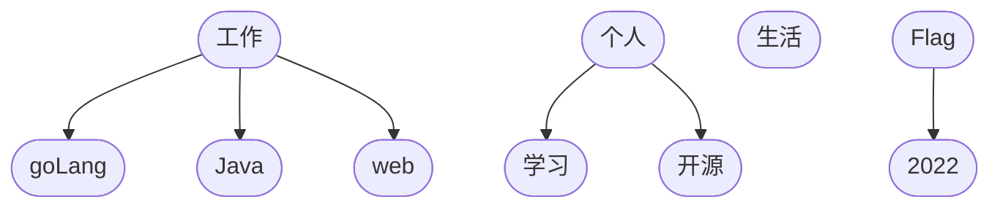
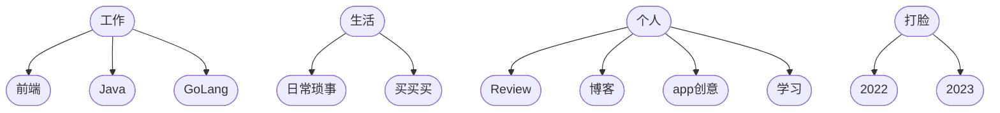

## 前言

第一次在使用滴答的时候，总能想象到我有多少个任务，我有多少种任务，咋分类？就像使用电脑的时候，我下载那么多的东西，一个一个分配文件夹，最后发现直接使用`macOS`自带的几个大的分类足矣...所以我去年看着别人做的分类也跟着走了一年，总感觉有那么一丝丝遗憾...我仅仅用自己的分类进行抛砖引玉，这玩意和文章分类一样，别指望一次性成功，一定要分配足够的时间来打磨它。

<!-- more -->

<InArticleAdsense
    data-ad-client="ca-pub-1725717718088510"
    data-ad-slot="7426219401">
</InArticleAdsense>

## 为什么要分类

在使用滴答清单完成一个待办事项其实很简单，创建任务-->做完任务-->标记完成。但是这个情况容易存在一个问题...就是所有的任务都堆在一起，零零散散的一堆，领不清。这时就只能是被迫无奈的进行任务分类了。

## 任务该如何分类

> 由于`meraid`这玩意不能使用`Emjoy`一用就无法出图，只好这样干了

最开始使用滴答清单的时候我是用各种搜索引擎搜一波，看看别人都是怎么分类的，毕竟它山之石可以攻玉嘛，于是最初的分类就是

::: center

:::

通过一年的使用过程中发现，这种分类用起来并不舒服，总觉得哪里缺了些什么，但也不知道乱在哪里，于是...在今年（`2023`年）尝试进行了一次改变，直接把结构图放在下面吧

::: center

:::

## 分类的理由

### 大类

我个人并不喜欢将任务分的过于细，一旦我将任务分的过于细的时候那么我就会陷入到这个任务该放哪里的纠结中。所以想了又想，省了又省大的分类就四个，其实和去年差不多😂

| 分组        | 理由 |
| :-----------: | ----------- |
| 💻 工作      | 没啥好说的，就针对工作；工作就该有工作的样子，不参合到普通的生活中       |
| 🌈 生活      | 主要是和家里相关的一些事情        |
| 🏆 个人      | 主要自己想干的一些事情           |
| 🏴‍☠️ 打脸      | 主要自己新的一年立下的`flag`，叫`flag`吧不合适...打脸这个就比较合适了  |

#### 💻 工作

> 工作下面原本想直接通过项目来分的，结果项目太凌乱了，这儿一丢丢那儿一丢丢的，而且基本上是写完了就不需要改的玩意...索性就按照语言+前端进行分类了

- 🍥 前端
  
  前端牵扯的语言太多了，索性就直接放在一起了

- 🐹 `GoLang`
- ☕️ `Java`

#### 🌈 生活

> 个人认为生活里面就两种情况，一种要做的事情；一种要买的东西

- 👌 日常琐事
- 🛒 买买买

#### 🏆 个人

> 个人下面的东西就比较凌乱了，估计还会进行一次优化的

- 🛵 `Review`

  主要用于复盘，因为比较懒，就直接按月复盘吧。如果后面能够坚持下来的话，那就考虑周复盘了

- 📝 博客
- 🗯 创意
- 📌 学习

#### 🏴‍☠️ 打脸

> 立`flag`等于打脸，我是深有体会，去年立了`5`个`flag`，结果只完成了`1`个

- 🐯 `2022`
- 🐰 `2023`

## `One More Thing`

使用了分类能够让滴答清单更好用吗，看完这个我用上了滴答清单能让我变成一个效率很高的人吗......

针对类似的问题我只能用两个字回答：「做梦」

使用效率类的`app`并不能让事情自己去完成，实时上在使用中还需要去花一定时间去排序和规整，这其实是增加了时间成本；任何`app`都不能把生活安排的明明白白，毕竟生活存在了各种惊喜和意外，安排的再完美抵不上其他人的从中作梗或者是被自己的拖延症打败......

但，我为什么还要继续用滴答清单呢？因为我能看到我的一天被我安排的明明白白的，我能看到需要做的事情是否真正的有做过；我觉得这一切还是有意义的，至少当我标记需要做的事情的时候，看到了就会去做，而不会因为遗忘或者没有任何提醒而白白浪费时间。

## 推广一下

::: center

**使用微信扫码领取7天会员**
:::

